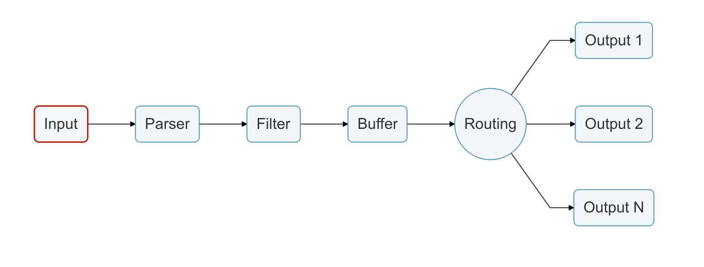

https://tech.isid.co.jp/entry/2022/05/09/Fluent_Bit%E3%82%92%E5%88%A9%E7%94%A8%E3%81%97%E3%81%9F%E3%83%AD%E3%82%B0%E3%83%AB%E3%83%BC%E3%83%86%E3%82%A3%E3%83%B3%E3%82%B0_-_%E5%85%A5%E9%96%80%E7%B7%A8

# Key Concepts
https://docs.fluentbit.io/manual/concepts/key-concepts

- Event or Record
    - 
- Filtering
    - イベント・コンテンツの変更を実施する
    - 例
        - IPアドレスやメタデータなどをイベントに追加する
        - 特定のパターンに一致するイベントを捨てる
- Tag
    - すべてのイベントにはタグが割り当てられる
    - タグは、後の段階で、ルーターが通過する必要があるフィルターまたは出力先？を決定するために使われる文字列
     - ほとんどのタグは手動で割り当てる
     - 指定されていない場合は、イベントの生成元のInputプラグインインスタンスの名前が自動で割り当てられる
     - 唯一Forward inputだけは、タグが割り当てられない
- Timestamp
    - イベント作成時刻
    - すべてのイベントにタイムスタンプが含まれる
        - Inputプラグインによって設定されるか、データ解析プロセスを通じて検出されて、常に存在する
    - 形式 `SECONDS.NANOSECONDS`
- Match
    - Fluent Bitは、イベントを1つまたは複数の宛先に配信できる
    - これはルーティングフェーズで行われます
    - Matchは、定義されたルールにタグが一致するイベントを選択する単純なルールを表する
- Structured Message
    - ソースイベントは構造化されている場合はされていない場合がある
    - 構造化されていない
        - `"Project Fluent Bit created on 1398289291"`
    - 構造化されている
        - jsonなど
        - `{"project": "Fluent Bit", "created": 1398289291}`
    - Fluent Bitは、常にすべてのイベントメッセージを構造化メッセージとして処理する

# Data Pipeline

https://docs.fluentbit.io/manual/concepts/data-pipeline

- Input - ソースからデータを収集する方法
- Parser - 非構造化メッセージを構造化メッセージに変換する
- Filter - レコードを変更、強化、削除する
- Buffer - 信頼性の高いデータ処理
- Router - 柔軟なルーティング ルールを作成する
- Output - データの宛先: データベース、クラウド サービスなど!

## Input
- データ収集のためにさまざまなInputプラグインがある
    - ログファイルから収集するだけのものから、OSからメトリクスを収集するものまで
- プラグインがロードされると、内部インスタンスが作成される
    - すべてのインスタンスには独立した構成がある
    - 構成キーはプロパティと呼ばれることがよくある
- すべてのInputプラグインには独自のドキュメントセクションがあり、使用方法と使用可能なプロパティが指定されている

あ

- `Forward` (TCPリスナポート経由のメッセージ受信) や `tail` (ローカルファイスシステム上のログファイルなどのtail) などで生データの入力を受け付ける

-------------------------

## Parser
- 各Inputプラグインによって独立したオプションで構成される

あ

- Inputで受け取ったデータをParserで処理する
- データ構造化やマルチライン処理を行う
    - マルチライン処理は、複数行データ（たとえば、Javaスタックトレースの「at」など）を1つのデータにすること
- `Input` と `Filter` で利用可能

-------------------------

## Filter
- データの配信前に変更できる機能
- フィルタリングはプラグインを通じて実装される
- InputとFilterは非常によく似ている
    - 独自の構成を持つインスタンスコンテキストで実行される
    - 構成キーはプロパティと呼ばれることがよくある
- 一般的な使用例
    - KubernetesのDeployment
        - すべてのPodロルで関連付けられた適切なメタデータを取得する

a

- 「Parser」「Multiline(Parser)」「Record Modifier」「Rewrite Tag」「Lua」「Kubernetes」などがある

-------------------------

## Buffer
- このフェーズではすでに不変状態のデータが含まれているため、他のフィルターは適用できない
- バッファされたデータは生のテキストではなく、Fluent Bitの内部バイナリ表現になっている

あ

- 生データを保管する領域として、「メモリ」または「ファイルシステム（永続領域）」を選択できる
- 「処理間隔（メモリリフレッシュ、データ出力などのタイミング）」「各種バッファサイズ（ファイル初期読み込みサイズなど）」はチューニング要素
- 「Service」「Input」「Output」プラグインなどで定義する
- 

-------------------------

## Router
- データを最終的に1つまたは複数の宛先にルーティングする機能
- TagsとMatchingのルールの概念がある
- Tag
    - イベントに割り当てられた文字列
    - 通常は手動で割り当てる
    - データソースを人間が識別するために役立つ
- Match
    - ルーティング先を定義するには、OutputでMatchのルールを指定する必要がある
    - Matchは、ワイルドカードと正規表現を使える
        - 正規表現を使う場合は、 `Match_regex`
- ルーティングは、Input TagsとOutput Matchルールを自動的に読み取る

a

- 出力対象となるデータは、Input時点でデータとひもづけられたTag（または、Filterで書き換えられたTag）をもとに「識別」できるようにする
- ルーティング条件は、Outputプラグインの「Match」と「Match_regex」により一致条件を設定する

-------------------------

## Output
- Outputインターフェースを利用すると、データの宛先を定義できる
- プラグインとして実装されており、多くのものが利用可能
- Outputプラグインがロードされると、内部インスタンスが作成される
    - すべてのインスタンスには独立した構成がある
    - 構成キーはプロパティと呼ばれることがよくある
- すべてのOutputプラグインには独自のドキュメントセクションがあり、使用方法と使用可能なプロパティが指定されている

# データの加工
- Inputデータは、「データフィールド名の追加・加工」「データ値の追加・加工」が可能
- どちらも Filter で可能
- データ値の追加・加工
    - すでにParserプラグインとして用意されているものがある
    - 独自に Parserは設定できる
